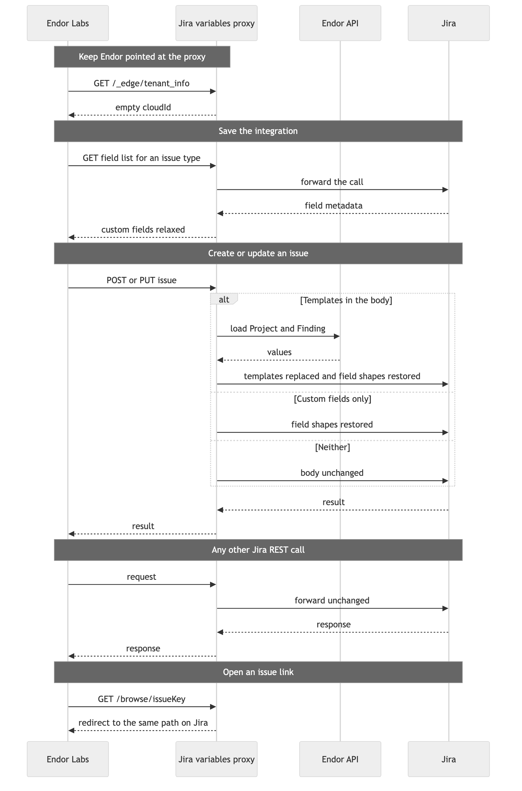

# Jira variables proxy

A single-tenant proxy that Endor Labs uses as its Jira server. It forwards the Jira REST calls Endor makes. On issue create and update it replaces `{{project…}}`, `{{finding…}}`, `{{packageversion…}}`, and `{{repositoryversion…}}` with values from the Endor API, then sends the issue to the real Jira server.

`GET /_edge/tenant_info` is answered by the proxy with an empty `cloudId`, so Endor keeps calling the proxy instead of `api.atlassian.com`.

`GET /browse/{issueKey}` redirects to the same path on `JIRA_BASE_URL`. Endor builds its issue links from the integration URL, so a click on `PROJ-1` opens the issue on the real Jira site.

## How it works



Endor sends the Jira `Authorization` header. The proxy forwards it and does not keep a Jira credential. It calls the Endor API only when an issue body contains `{{project…}}`, `{{finding…}}`, `{{packageversion…}}`, or `{{repositoryversion…}}`.

## Run

```bash
docker build -t jira-variables-proxy .
docker run --rm -p 8080:8080 \
  -v "$PWD/.env:/app/.env:ro" \
  jira-variables-proxy
```

Settings come from a `.env` file in the working directory (`/app/.env` in the image). The process exits if that file is missing or if `ENDOR_API_CREDENTIALS_KEY` or `ENDOR_API_CREDENTIALS_SECRET` is empty. On startup it exchanges that key for an Endor token and exits if Endor rejects it. No namespace is required for that check. The key still has to be able to read every namespace that raises a ticket. See `.env.example`.

Point the Endor Jira integration at `PUBLIC_BASE_URL` and leave its Jira user and API token as they are for the real Jira site. The proxy forwards that `Authorization` header. It does not store a Jira credential. `ENDOR_API_CREDENTIALS_KEY` and `ENDOR_API_CREDENTIALS_SECRET` are the only secrets it keeps, and it uses them to read Project and Finding data.

`GET /healthz` does not require authentication.

## Local testing

`scripts/stand-up.sh` starts the proxy from the `.env` file in this directory and opens it on a fixed ngrok address. It does not change the Endor tenant. It prints the URL to put on the Jira integration, and the `JIRA_BASE_URL` those requests are forwarded to. Request logs print in the terminal. Ctrl-C stops the proxy and the tunnel.

```bash
ngrok config add-authtoken <token>
NGROK_URL=https://your-name.ngrok-free.app ./scripts/stand-up.sh
```

ngrok must be installed and authenticated. `NGROK_URL` is a static domain from the [ngrok dashboard](https://dashboard.ngrok.com/domains). A free account includes one. Use that same domain on every run and set it once on the Jira integration. A random ngrok address changes each start, and Endor then gets an empty tunnel.

A free ngrok domain shows a browser warning before the request reaches the proxy. Endor's API calls do not see that page. The proxy served from its own host redirects `GET /browse/{issueKey}` straight to Jira.

## Templates

Templates are configured on each Jira notification integration in Endor Labs, not on the proxy. In Custom Fields, the key is the Jira field name and the value is the template. Labels can hold templates too. Each connection keeps its own fields.

The value is a path on the Project, Finding, PackageVersion, or RepositoryVersion JSON, for example `{{project.meta.tags}}`, `{{project.spec.internal_reference_key}}`, `{{finding.spec.level}}`, or `{{packageversion.meta.name}}`. Endor sends that string on the issue, and the proxy replaces it before Jira sees the request. The surrounding JSON shape is kept, so a priority field sent as `{"name": "{{finding.spec.level}}"}` stays a name object.

`{{packageversion…}}` is the PackageVersion identified by `finding.meta.parent_uuid` when `finding.meta.parent_kind` is `PackageVersion`. `{{repositoryversion…}}` is the same id when the parent is a `RepositoryVersion`. A finding has one parent, so only one of those objects is loaded. A value can name both, and the placeholder whose object was not loaded is left out, for example to identify a branch use:

```text
{{packageversion.spec.source_code_reference.version.ref}}{{repositoryversion.spec.version.ref}}
```


Example custom fields on issue type Task:

| Jira field | Template |
| --- | --- |
| Service Endpoint | `{{project.spec.git.http_clone_url}}` |
| Severity | `{{finding.spec.level \| label}}` |
| CVSS 3.1 | `{{finding.spec.finding_metadata.vulnerability.spec.cvss_v3_severity.score}}` |
| References | `https://app.endorlabs.com/t/{{finding.tenant_meta.namespace}}/findings/{{finding.uuid}}` |
| Squad | `{{project.meta.tags.squad}}` |
| Priority | `{{finding.spec.level \| label}}` |
| Branch | `{{packageversion.spec.source_code_reference.version.ref}}{{repositoryversion.spec.version.ref}}` |

`| label` turns an Endor enum into words. `{{finding.spec.level | label}}` is `Medium` when the finding level is `FINDING_LEVEL_MEDIUM`. The same filter covers the other finding levels and a few other enum prefixes, such as `LEVEL_` and `VALIDATION_STATUS_`. A value it does not recognize is sent as null. Without the filter, `{{finding.spec.level}}` stays `FINDING_LEVEL_MEDIUM`.

`{{project.meta.tags}}` is the whole list, joined with commas. Tags written as `name=value`, such as `tribe=digital-channels`, are read with one more segment: `{{project.meta.tags.tribe}}` is `digital-channels`. A name that is not in the list is sent as null.

What gets filled in depends on the aggregation type on the action policy. The proxy reads the project and finding links in the issue description Endor writes.

| Aggregation | Tickets | `{{project…}}` | `{{finding…}}` |
| --- | --- | --- | --- |
| None (Notify for each Finding) | One issue per finding, using the configured issue type | Resolved | Resolved |
| Project | One issue per project. The description lists every finding on that project | Resolved | Null. The issue is not for one finding |
| Dependency per Package Version | A parent issue, plus a child for each dependency and package version | Resolved on the parent and the child | Null on the parent. Resolved on the child |
| Dependency | A parent issue, plus a child for each dependency across package versions | Resolved on the parent and the child | Null on the parent. Resolved on the child |

The parent uses the configured issue type. The child uses the configured child issue type, or Sub-task when that is blank. The parent description links the project and tells the reader to review the child tasks. It does not link a finding, so a finding template is null on the parent. A child description links the project and the findings for that dependency, so both are resolved.

A Project issue also links the project, and it links every finding in the description. Those links identify the set of findings, not one finding to copy into a field, so finding templates are null on that issue. Project templates are still resolved.

A ticket opened for one finding from the Endor UI follows the same rule as None: one issue, and both project and finding templates are resolved.

A path that is missing, empty, or null on an object that was loaded is sent as JSON null, and the rest of the issue is still created. That still applies when the same value contains another placeholder: a broken finding URL stays null rather than being sent with a hole in it. An unresolved label is left off the label list. `project.spec.ingestion_token` is a credential and is never read.

Custom select and number fields can hold templates. Endor would otherwise reject them while saving the integration: a select value has to already be one of the options, and a number has to be an integer. The proxy hides those constraints on custom fields when Endor reads the field list, and it shows a number field to Endor as text. When a ticket is created, the proxy fills the template and sends Jira the real shape. Severity `Medium` goes out as `{"value": "Medium"}`. A CVSS score goes out as a number. A paragraph field on Jira Cloud is sent as an Atlassian document, because a plain string is rejected.

The same treatment applies to the system Priority field. Its options are names such as High and Medium, which Endor does not read, so a template there normally fails at save time with an empty allowed list. The proxy hides those options and, on create, sends `{"name": "Medium"}`. The word has to be one of that Jira project's priority names. `Critical` is a finding level, and it is not a default Jira priority.

The trap is that saving the integration no longer checks the value. Endor will store `{{finding.spec.level | label}}` even when the words it produces are not options on that field. The failure shows up when a ticket is created, and the error names the options Jira actually has. Putting the integration URL back on the real Jira site makes Endor check the options again, and those saved templates stop passing.

## Troubleshooting

A failed create stays in Endor as a notification. There is no resend action. The notification UUID is on the notification in **User menu** > **Notifications**, including when the row is an on-demand notification from **Create JIRA ticket**.

```bash
endorctl api get -r Notification --uuid <notification-uuid> -n <namespace> \
  --field-mask spec.state \
  --field-mask spec.notification_action_data \
  --field-mask spec.notification_external_ids \
  --field-mask spec.aggregation_details.aggregation_type
```

Jira never stored an issue when `spec.state` is `NOTIFICATION_STATE_OPEN_NOTIFICATION_PENDING`, `open_action_complete` is false, and `spec.notification_external_ids` is empty. `error_status` on the Jira target is the reason. A priority outside that project's names fails here. `Critical` is a finding level, and it is not a default Jira priority. Fix the value before trying again, or the next create fails the same way.

A finding that already has a manual notification for that Jira integration cannot get a second one. Delete the failed notification, then use **Create JIRA ticket** on the finding again. Deleting it does not remove a Jira issue, because none was created.

```bash
endorctl api delete -r Notification --uuid <notification-uuid> -n <namespace>
```

Leave a notification that already has a Jira issue key. That issue stays in Jira, and another create opens a second one.
